# EProject Microservices

## Tổng quan dự án

Đây là một hệ thống microservices cho ứng dụng e-commerce, được xây dựng với Node.js, Express, MongoDB và RabbitMQ.

### System Architecture
```
API Gateway (Port 3003) - Entry Point
    ├── Auth Service (Port 3000) - Đăng ký, đăng nhập
    ├── Product Service (Port 3001) - Quản lý sản phẩm  
    └── Order Service (Port 3002) - Xử lý đơn hàng
```

### Technologies Used
- **Node.js & Express.js** - Backend services
- **MongoDB** - Database
- **JWT** - Authentication tokens
- **RabbitMQ** - Message queuing
- **Docker** - Containerization

### Main Features
1. **Authentication** - Register, login, verify token
2. **Product Management** - CRUD operations
3. **Order Processing** - Tạo và quản lý đơn hàng
4. **Message Queuing** - Inter-service communication
5. **API Gateway** - Request routing

## Quick Start

### Prerequisites
- Node.js 18+
- MongoDB
- Git

### Installation & Setup

# 1. Install dependencies cho tất cả services
npm run install:all

# 2. Start tất cả services
npm run dev
```

### Docker Setup
```bash
# Start toàn bộ hệ thống với Docker
npm run docker:up

# Stop hệ thống
npm run docker:down
```

## API Testing với POSTMAN

### 🎯 Quick Reference - Correct URLs

| Service | Via API Gateway (Port 3003) | Direct Access | 
|---------|------------------------------|---------------|
| **Auth** | `http://localhost:3003/auth/*` | `http://localhost:3000/*` |
| **Products** | `http://localhost:3003/products/api/products` | `http://localhost:3001/api/products` |
| **Orders** | `http://localhost:3003/orders/api/orders` | `http://localhost:3002/api/orders` |

**⚠️ Lưu ý quan trọng**: Luôn dùng API Gateway (port 3003) để test tích hợp đầy đủ!

### Bước 1: Verify Services Running
Kiểm tra tất cả services đã chạy:
- **API Gateway**: `GET http://localhost:3003/health`
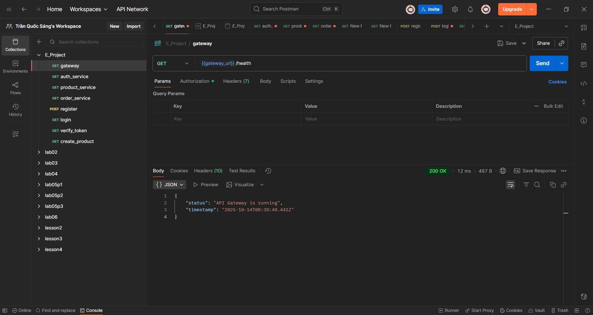
- **Auth Service**: `GET http://localhost:3000/health` 
 
- **Product Service**: `GET http://localhost:3001/health`
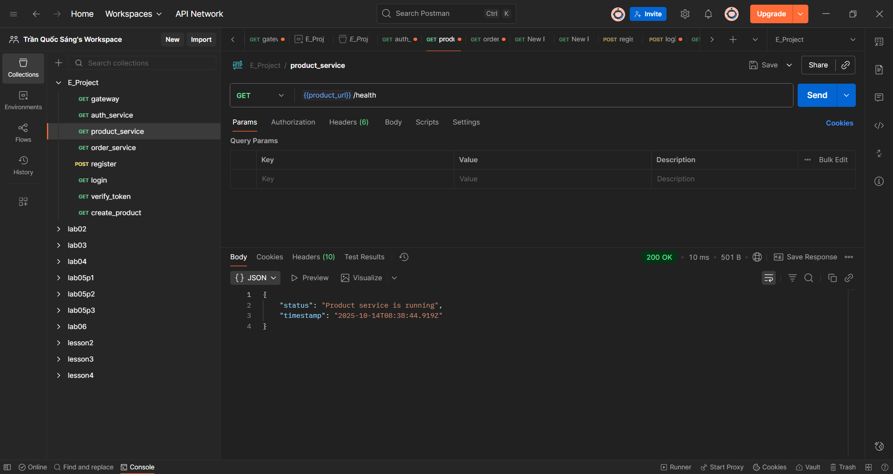
- **Order Service**: `GET http://localhost:3002/health`
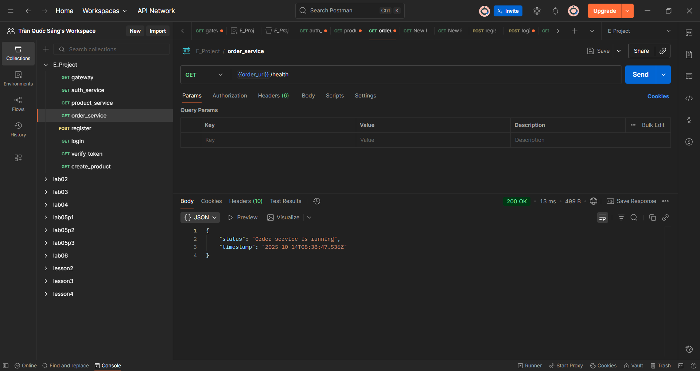
### Bước 2: Authentication Flow

#### 2.1 Register User
```
Method: POST
URL: http://localhost:3003/auth/register
Headers: Content-Type: application/json
Body (JSON):
{
  "username": "testuser",
  "password": "password123"
}
```
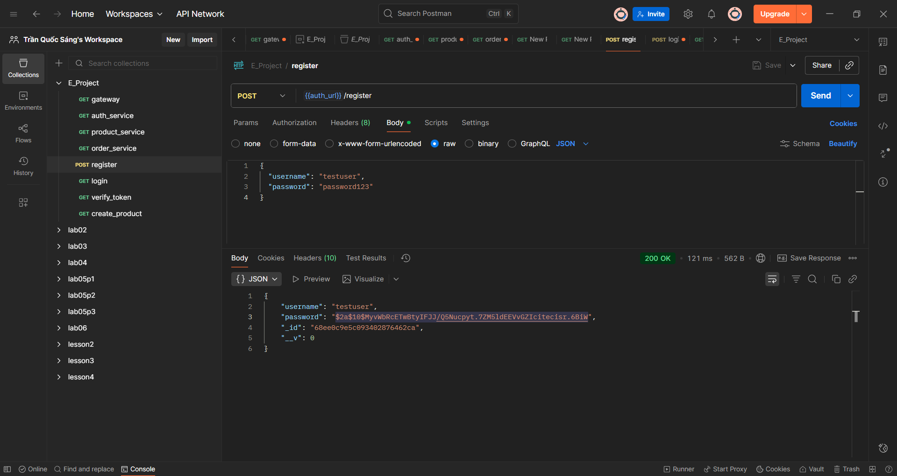

#### 2.2 Login User
```
Method: POST
URL: http://localhost:3003/auth/login
Headers: Content-Type: application/json
Body (JSON):
{
  "username": "test@testuser.com",
  "password": "password123"
}
```
--Respone trả về sẽ chứa token
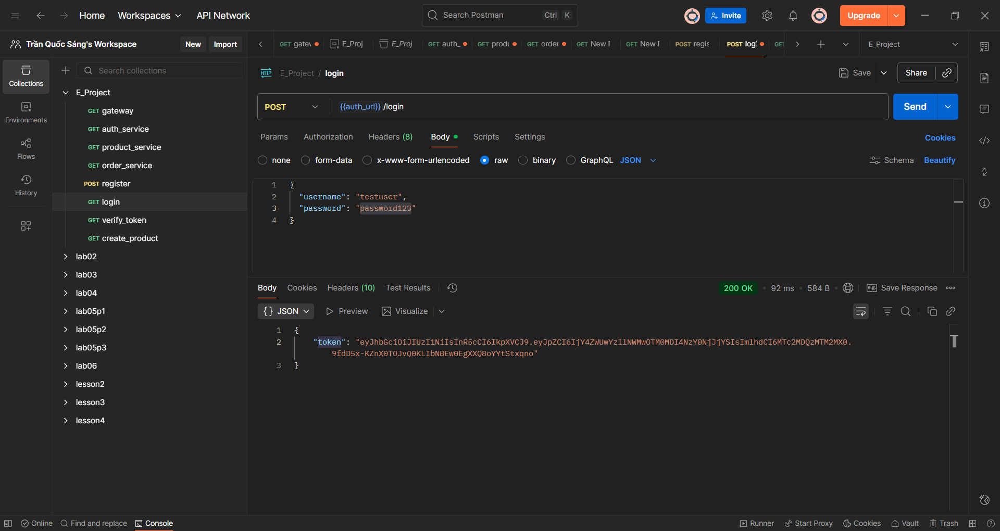

#### 2.3 Test Protected Endpoints
```
Method: GET
URL: http://localhost:3003/auth/dashboard
Headers: 
  - Content-Type: application/json
  - Authorization: Bearer YOUR_JWT_TOKEN_HERE
```


```
Method: GET  
URL: http://localhost:3003/auth/verify
Headers:
  - Authorization: Bearer YOUR_JWT_TOKEN_HERE
```
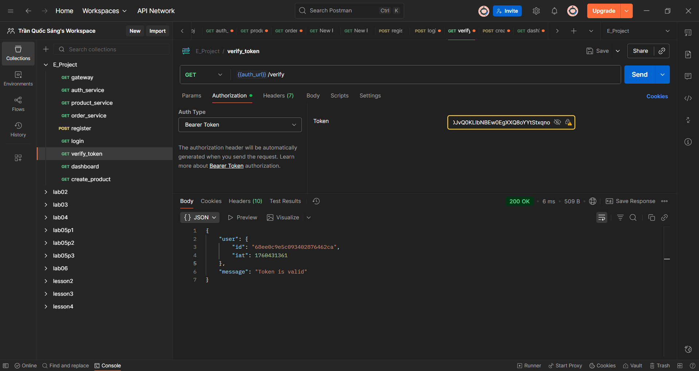

### Bước 3: Product Management APIs

**Lưu ý**: Tất cả Product APIs đều cần JWT token trong header `Authorization: Bearer YOUR_TOKEN`


#### 3.1 Create New Product
```
Method: POST
URL: http://localhost:3003/products/api/products
Headers: 
  - Content-Type: application/json
  - Authorization: Bearer YOUR_JWT_TOKEN
Body (JSON):
{
  "name": "iPhone 15",
  "description": "Latest iPhone model",
  "price": 999,
  "category": "Electronics",
  "stock": 50
}
```
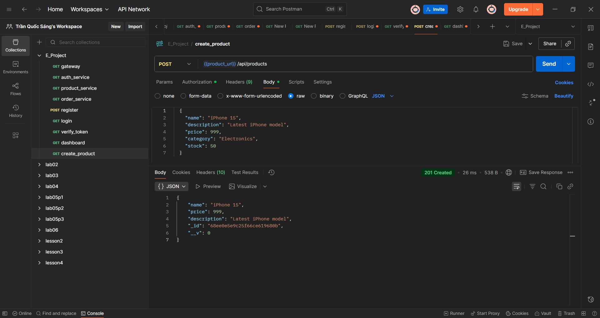


#### 3.2 Get All Products
```
Method: GET
URL: http://localhost:3003/products/api/products
Headers: Authorization: Bearer YOUR_JWT_TOKEN
```
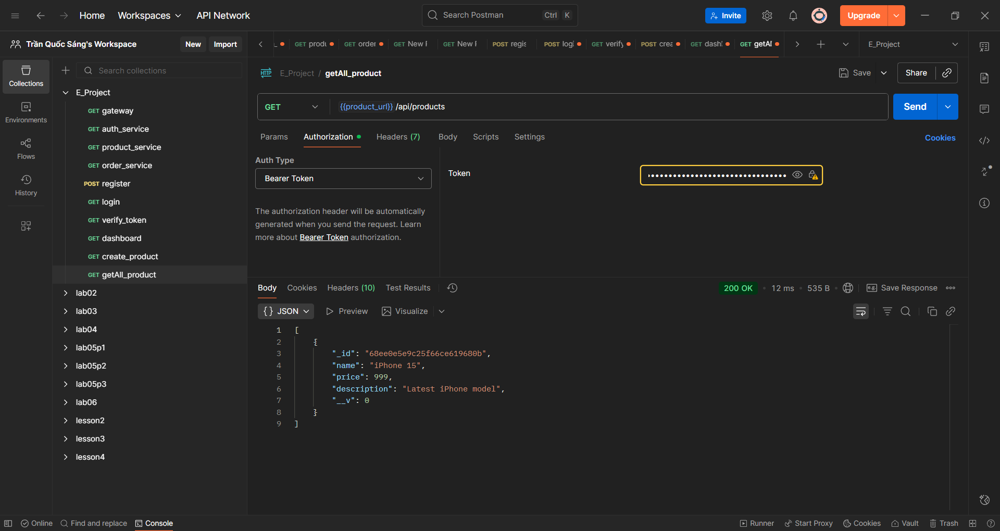

#### 3.3 Get Product by ID
```
Method: GET
URL: http://localhost:3003/products/api/products/PRODUCT_ID
Headers: Authorization: Bearer YOUR_JWT_TOKEN
```
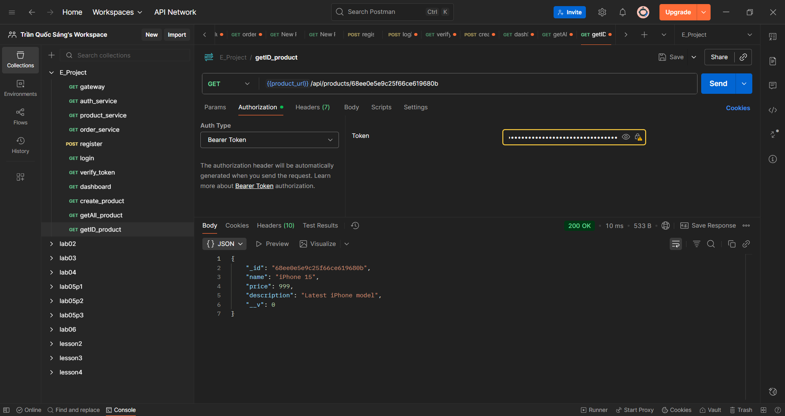

#### 3.4 Update Product
```
Method: PUT
URL: http://localhost:3003/products/api/products/PRODUCT_ID
Headers:
  - Content-Type: application/json
  - Authorization: Bearer YOUR_JWT_TOKEN
Body (JSON):
{
  "name": "iPhone 15 Pro",
  "price": 1099,
  "stock": 30
}
```
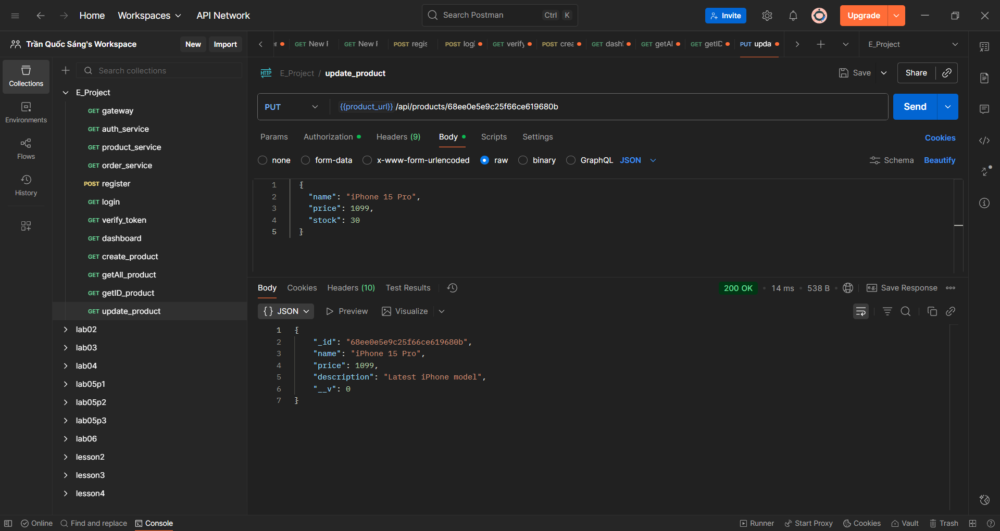

#### 3.5 Delete Product
```
Method: DELETE
URL: http://localhost:3003/products/api/products/PRODUCT_ID
Headers: Authorization: Bearer YOUR_JWT_TOKEN
```
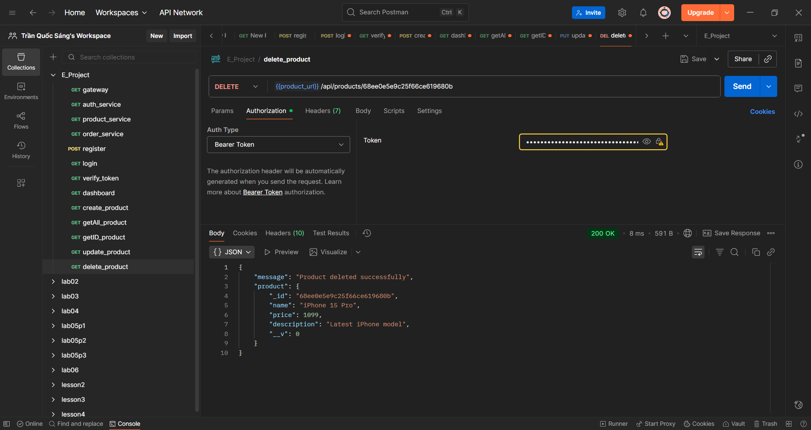

### Bước 4: Order Management APIs

#### 4.1 Create New Order
```
Method: POST
URL: http://localhost:3003/orders/api/orders
Headers:
  - Content-Type: application/json
  - Authorization: Bearer YOUR_JWT_TOKEN
Body (JSON):
{
  "items": [
    {
      "productId": "674d123456789abcdef12345",
      "quantity": 2,
      "price": 999
    }
  ],
  "totalAmount": 1998,
  "shippingAddress": "123 Nguyen Trai, HCM"
}
```
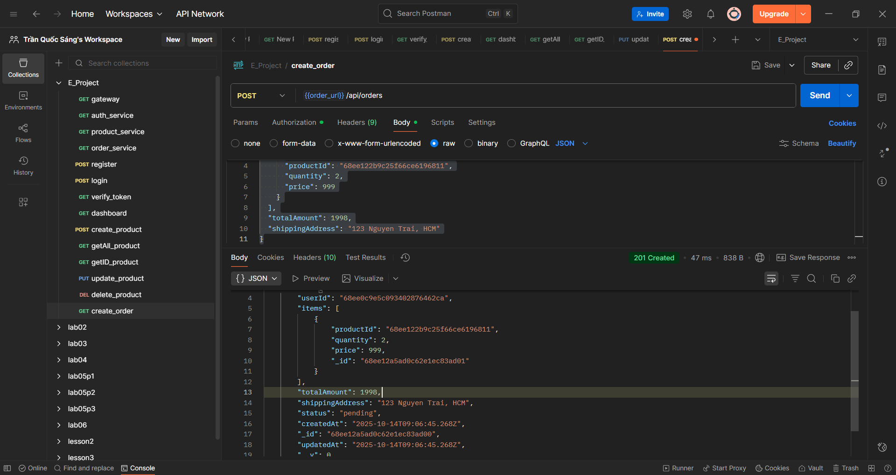

#### 4.2 Get User's Orders
```
Method: GET
URL: http://localhost:3003/orders/api/orders
Headers: Authorization: Bearer YOUR_JWT_TOKEN
```
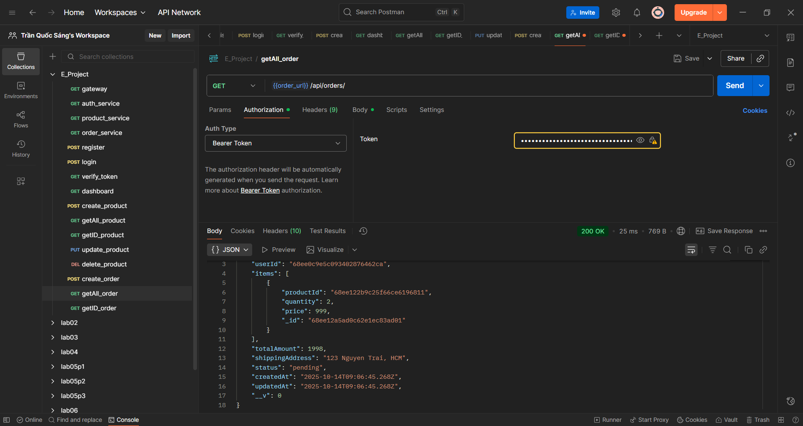

#### 4.3 Get Order by ID
```
Method: GET
URL: http://localhost:3003/orders/api/orders/ORDER_ID_HERE
Headers: Authorization: Bearer YOUR_JWT_TOKEN
```
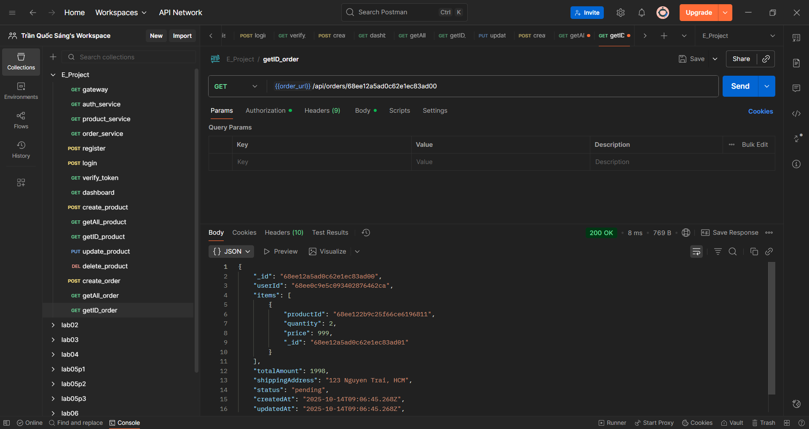

#### 4.4 Get Order status
```
Method: PUT
URL: http://localhost:3003/orders/api/orders/ORDER_ID_HERE/status
Headers: Authorization: Bearer YOUR_JWT_TOKEN
```
```
Method: POST
URL: http://localhost:3000/orders/api/orders
Headers:
  - Content-Type: application/json
  - Authorization: Bearer YOUR_JWT_TOKEN
Body (JSON):
{
  "items": [
    {
      "productId": "674d123456789abcdef12345",
      "quantity": 2,
      "price": 999
    }
  ],
  "totalAmount": 1998,
  "shippingAddress": "123 Nguyen Trai, HCM"
}
```


#### 4.2 Get User's Orders
```
Method: GET
URL: http://localhost:3000/orders/api/orders
Headers: Authorization: Bearer YOUR_JWT_TOKEN
```
```
Method: POST
URL: http://localhost:3000/api/orders
Headers:
  - Content-Type: application/json
  - Authorization: Bearer YOUR_JWT_TOKEN
Body (JSON):
{
  "items": [
    {
      "productId": "..",
      "quantity": 2,
      "price": 999
    }
  ],
  "totalAmount": 1998,
  "shippingAddress": "123 Nguyen Trai, HCM"
}
```


#### 4.2 Get User's Orders
```
Method: GET
URL: http://localhost:3000/api/orders
Headers: Authorization: Bearer YOUR_JWT_TOKEN
```


#### 4.3 Get Order by ID
```
Method: GET
URL: http://localhost:3000/orders/api/orders/ORDER_ID_HERE
Headers: Authorization: Bearer YOUR_JWT_TOKEN
```


#### 4.4 Get Order status
```
Method: PUT
URL: http://localhost:3000/orders/api/orders/ORDER_ID_HERE/status
Headers: Authorization: Bearer YOUR_JWT_TOKEN
```
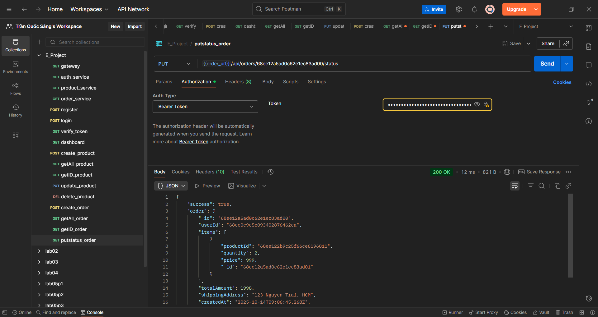

### Bước 5: Error Testing Cases

#### 5.1 Authentication Errors

**Test 1: Login với sai password**
```
Method: POST
URL: http://localhost:3003/auth/login
Body: {
  "username": "testuser",
  "password": "wrongpass"
}
Expected: 401 Unauthorized
```

**Test 2: Access protected endpoint không có token**
```
Method: GET
URL: http://localhost:3003/auth/dashboard
Headers: (không có Authorization)
Expected: 401 Unauthorized
```

**Test 3: Access với invalid token**
```
Method: GET
URL: http://localhost:3003/auth/dashboard
Headers: Authorization: Bearer invalid_token_here
Expected: 401 Unauthorized
```

#### 5.2 Product Validation Errors

**Test 4: Create product thiếu required fields**
```
Method: POST
URL: http://localhost:3003/products/api/products
Headers: Authorization: Bearer YOUR_TOKEN
Body: {
  "name": "iPhone 15"
  // thiếu price, description
}
Expected: 400 Bad Request
```

**Test 5: Create product với giá âm**
```
Method: POST
URL: http://localhost:3003/products/api/products
Headers: Authorization: Bearer YOUR_TOKEN
Body: {
  "name": "iPhone 15",
  "price": -100,
  "description": "Test"
}
Expected: 400 Bad Request
```

**Test 6: Get product với invalid ID**
```
Method: GET
URL: http://localhost:3003/products/api/products/invalid_id
Headers: Authorization: Bearer YOUR_TOKEN
Expected: 404 Not Found
```

#### 5.3 Order Validation Errors

**Test 7: Create order với items trống**
```
Method: POST
URL: http://localhost:3003/orders/api/orders
Headers: Authorization: Bearer YOUR_TOKEN
Body: {
  "items": [],
  "totalAmount": 1998,
  "shippingAddress": "123 Nguyen Trai"
}
Expected: 400 Bad Request
```

**Test 8: Create order thiếu totalAmount**
```
Method: POST
URL: http://localhost:3003/orders/api/orders
Headers: Authorization: Bearer YOUR_TOKEN
Body: {
  "items": [{
    "productId": "68ee122b9c25f66ce6196811",
    "quantity": 2,
    "price": 999
  }],
  "shippingAddress": "123 Nguyen Trai"
}
Expected: 400 Bad Request
```

**Test 9: Create order với productId không tồn tại**
```
Method: POST
URL: http://localhost:3003/orders/api/orders
Headers: Authorization: Bearer YOUR_TOKEN
Body: {
  "items": [{
    "productId": "nonexistent_product_id",
    "quantity": 2,
    "price": 999
  }],
  "totalAmount": 1998,
  "shippingAddress": "123 Nguyen Trai"
}
Expected: Có thể 400 hoặc order tạo thành công (tùy business logic)
```

**Test 10: Get order của user khác**
```
Method: GET
URL: http://localhost:3003/orders/api/orders/OTHER_USER_ORDER_ID
Headers: Authorization: Bearer YOUR_TOKEN
Expected: 403 Forbidden
```

#### 5.4 System Errors

**Test 11: API Gateway khi service down**
- Stop product service: `npm run stop:product`
- Test: `GET http://localhost:3003/products/api/products`
- Expected: 502 Bad Gateway hoặc timeout

**Test 12: Database connection errors**
- Stop MongoDB
- Test any API that requires database
- Expected: 500 Internal Server Error

**Test 13: Invalid JSON format**
```
Method: POST
URL: http://localhost:3003/products/api/products
Headers: 
  - Authorization: Bearer YOUR_TOKEN
  - Content-Type: application/json
Body: { invalid json format here
Expected: 400 Bad Request
```

#### 5.5 Rate Limiting / Security Tests

**Test 14: Very large request body**
```
Method: POST  
URL: http://localhost:3003/products/api/products
Body: (very large JSON > 1MB)
Expected: 413 Payload Too Large
```

**Test 15: SQL Injection attempts**
```
Method: GET
URL: http://localhost:3000/products/api/products/'; DROP TABLE products; --
Expected: 400 Bad Request hoặc safe handling
```

### Error Response Format Expectations

Tất cả error responses nên có format:
```json
{
  "error": "Error message description",
  "code": "ERROR_CODE", 
  "timestamp": "2025-10-14T10:30:00Z"
}
```

### Testing Flow Recommendations

1. **Start Services**: Chạy `npm run dev` hoặc `npm run docker:up`
2. **Health Check**: Test tất cả `/health` endpoints
3. **Register**: Tạo user account mới
4. **Login**: Lấy JWT token từ response
5. **Test Auth**: Verify token với `/dashboard` và `/verify`
6. **Create Products**: Tạo một vài products để test
7. **Manage Products**: Test CRUD operations
8. **Create Orders**: Test order creation với existing products
9. **View Orders**: Test order retrieval
10. **Error Testing**: Test tất cả các error cases above
11. **Edge Cases**: Test với data limits, special characters
12. **Security**: Test unauthorized access, injection attempts


### Expected HTTP Status Codes

- **200 OK**: Successful GET, PUT requests
- **201 Created**: Successful POST (create)
- **400 Bad Request**: Validation errors, malformed JSON
- **401 Unauthorized**: Missing/invalid authentication
- **403 Forbidden**: Valid auth but no permission
- **404 Not Found**: Resource doesn't exist
- **500 Internal Server Error**: Server/database issues
- **502 Bad Gateway**: Service unavailable (via API Gateway)

### Security Testing Checklist

- [ ] Test without Authorization header
- [ ] Test with expired JWT token
- [ ] Test with malformed JWT token
- [ ] Test accessing other users' data
- [ ] Test with very large payloads
- [ ] Test with special characters in input
- [ ] Test with SQL injection attempts
- [ ] Test with XSS payloads
- [ ] Test rate limiting (if implemented)
- [ ] Test CORS headers properly set

### Common Issues & Solutions

- **401 Unauthorized**: Kiểm tra JWT token trong Authorization header
- **404 Not Found**: Đảm bảo đúng URL path `/api/products` cho product service
- **500 Internal Error**: Check MongoDB connection và service logs
- **CORS Errors**: Tất cả services đã config CORS headers

## Project Structure

```
EProject-Phase-1/
├── api-gateway/          # API Gateway service
├── auth/                 # Authentication service
├── product/              # Product management service
├── order/                # Order processing service
├── public/               # Static assets
├── docker-compose.yml    # Docker configuration
└── package.json          # Root configuration
```

## Docker Support

Full Docker support với MongoDB và RabbitMQ:

```bash
npm run docker:up      # Start tất cả services
npm run docker:logs    # View logs
npm run docker:down    # Stop tất cả services
```